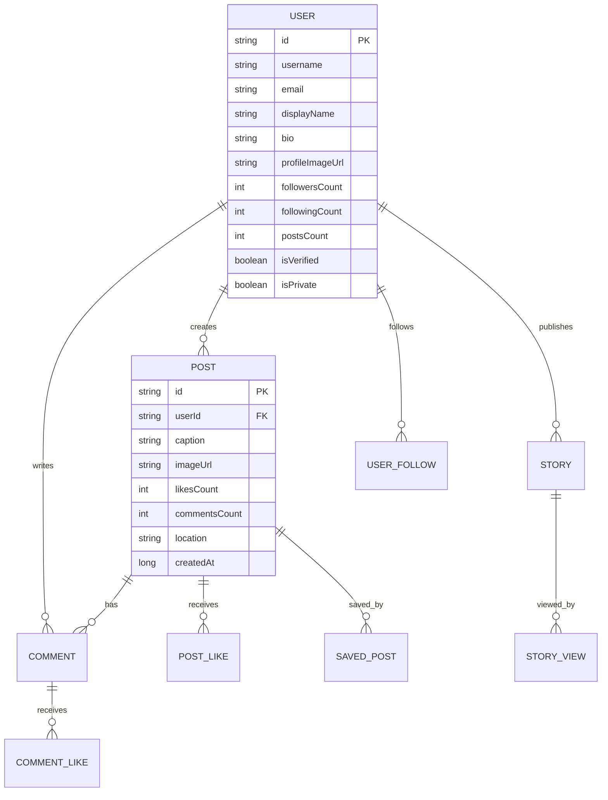

# 📸 Idatgram - Clon de Instagram con Kotlin Compose

Un clon educativo de Instagram desarrollado con **Kotlin Compose**, **Room Database**, **Material Design 3** y arquitectura moderna de Android.

## 🎯 Objetivos Educativos

Este proyecto está diseñado para enseñar los conceptos fundamentales de desarrollo Android:

- **XML vs Editor Gráfico**: Comparación y migración a Compose
- **Layouts**: Diferencias entre LinearLayout y RelativeLayout (conceptos aplicados en Compose)
- **Widgets Básicos**: Implementación de componentes Material Design
- **Actividades**: Gestión del ciclo de vida y navegación
- **Internacionalización**: Soporte multiidioma
- **Base de Datos**: Room para persistencia local
- **Arquitectura Moderna**: MVVM, Repository Pattern, Hilt

## 🛠️ Tecnologías Utilizadas

### Core
- **Kotlin** - Lenguaje de programación
- **Jetpack Compose** - UI moderna y declarativa
- **Material Design 3** - Sistema de diseño
- **Hilt** - Inyección de dependencias

### Base de Datos y Persistencia
- **Room** - Base de datos local SQLite
- **DataStore** - Almacenamiento de preferencias
- **Gson** - Serialización JSON

### Navegación y UI
- **Navigation Compose** - Navegación entre pantallas
- **Coil** - Carga de imágenes
- **Lifecycle** - ViewModels y estados

### Testing
- **JUnit** - Tests unitarios
- **Espresso** - Tests de UI
- **Truth** - Assertions mejoradas

## 📱 Características Implementadas

### ✅ Completadas
- [x] Configuración del proyecto con dependencias modernas
- [x] Tema personalizado estilo Instagram
- [x] Base de datos Room con entidades completas
- [x] Componentes UI reutilizables (botones, campos, cards)
- [x] Sistema de navegación con Bottom Navigation
- [x] Internacionalización (Español/Inglés)
- [x] Arquitectura base con repositorios
- [x] Pantallas de autenticación (Login/Registro)
- [x] Integración con API REST
- [x] Interacciones en publicaciones (likes, guardados)
- [x] Feed principal con posts
- [x] Barra de stories
- [x] Posts con comentarios
- [x] Pantalla de perfil de usuarios

### 🚧 En Desarrollo
- [ ] Búsqueda y exploración

### 🔮 Futuras Implementaciones
- [ ] Notificaciones push
- [ ] Stories con temporizador
- [ ] Chat directo
- [ ] Filtros de cámara

## 📂 Estructura del Proyecto

```
app/
├── src/main/java/pe/edu/idat/dsi/dami/idatgram/
│   ├── data/                          # Capa de datos
│   │   ├── dao/                       # Data Access Objects
│   │   │   ├── UserDao.kt
│   │   │   ├── PostDao.kt
│   │   │   ├── CommentDao.kt
│   │   │   └── StoryDao.kt
│   │   ├── database/                  # Configuración Room
│   │   │   └── IdatgramDatabase.kt
│   │   ├── entity/                    # Entidades de BD
│   │   │   ├── User.kt
│   │   │   ├── Post.kt
│   │   │   ├── Comment.kt
│   │   │   └── Story.kt
│   │   └── remote/                    # APIS
│   │   │   ├── dto/
│   │   │   │   ├── CommentDto.kt 
│   │   │   │   ├── UserDto.kt
│   │   │   │   └── PostDto.kt
│   │   │   └── IdatgramApiService.kt
│   │   └── repository/                # Repositorios
│   │       ├── CommentRepository.kt
│   │       ├── LocalDatabaseRepository.kt
│   │       ├── UserRepository.kt
│   │       └── PostRepository.kt
│   │   └── session/                  # Manejo de sesión
│   │       └── SessionManager.kt
│   ├── di/                           # Inyección de dependencias
│   │   ├── DatabaseModule.kt
│   │   └── NetworkModule.kt
│   ├── navigation/                   # Navegación
│   │   ├── IdatgramRoutes.kt
│   │   ├── IdatgramNavGraph.kt
│   │   └── IdatgramBottomNavigation.kt
│   ├── ui/
│   │   ├── components/               # Componentes reutilizables
│   │   │   ├── Buttons.kt
│   │   │   ├── TextFields.kt
│   │   │   └── Cards.kt
│   │   ├── screens/                  # Pantallas
│   │   │   ├── addpost/
│   │   │   │   └── AddPostScreen.kt
│   │   │   ├── auth/
│   │   │   │   ├── LoginScreen.kt
│   │   │   │   └── RegisterScreen.kt
│   │   │   ├── comment/
│   │   │   │   └── CommentScreen.kt
│   │   │   ├── home/
│   │   │   │   └── HomeScreen.kt
│   │   │   └── profile/
│   │   │       └── ProfileScreen.kt
│   │   ├── theme/                    # Tema personalizado
│   │   │   ├── Color.kt
│   │   │   ├── Theme.kt
│   │   │   └── Type.kt
│   │   └── viewmodel/                # ViewModels
│   │       ├── AddPostViewModel.kt
│   │       ├── CommentsViewModel.kt
│   │       ├── HomeViewModel.kt
│   │       ├── LoginViewModel.kt
│   │       └── SessionViewModel.kt
│   ├── IdatgramApplication.kt        # Application principal
│   └── MainActivity.kt               # Activity principal
├── src/main/res/
│   ├── values/strings.xml           # Strings en español
│   └── values-en/strings.xml        # Strings en inglés
└── build.gradle.kts                 # Configuración del módulo
```

## 🏗️ Arquitectura

### Patrón MVVM + Repository

```
┌─────────────────┐     ┌─────────────────┐      ┌─────────────────┐
│   UI (Compose)  │  -> │    ViewModel    │  ->  │   Repository    │
└─────────────────┘     └─────────────────┘      └─────────────────┘
                                                          │
                                                          v
                              ┌──────────────────┐    ┌─────────────────┐
                              │   Remote API     │    │  Local Database │
                              │   (MyJSONServer) │    │     (Room)      │
                              └──────────────────┘    └─────────────────┘
```

### Base de Datos Room



## 🚀 Instalación y Configuración

### Requisitos Previos
- Android Studio Hedgehog (2023.1.1) o superior
- JDK 11 o superior
- Android SDK 34
- Dispositivo/Emulador con API 29+

### Pasos de Instalación

1. **Clonar el repositorio**
   ```bash
   git clone https://github.com/tu-usuario/idatgram.git
   cd idatgram
   ```

2. **Abrir en Android Studio**
   - Abrir Android Studio
   - Seleccionar "Open an existing project"
   - Navegar a la carpeta del proyecto

3. **Sincronizar dependencias**
   ```bash
   ./gradlew clean build
   ```

4. **Ejecutar la aplicación**
   - Conectar dispositivo o iniciar emulador
   - Ejecutar desde Android Studio o:
   ```bash
   ./gradlew installDebug
   ```

## 🎓 Uso Educativo

### Para Estudiantes

Este proyecto está estructurado en **módulos progresivos**:

1. **Módulo 1**: Configuración y componentes básicos
2. **Módulo 2**: Base de datos y arquitectura
3. **Módulo 3**: Navegación y pantallas
4. **Módulo 4**: Funcionalidades avanzadas

### Para Profesores

El proyecto incluye:
- **Comentarios extensivos** en el código
- **TODOs estructurados** para completar en clase
- **Ejercicios progresivos** de dificultad creciente
- **Ejemplos comparativos** (XML vs Compose)

### Ejercicios Sugeridos

1. **Componentes básicos**:
   - Crear nuevos componentes UI
   - Personalizar el tema de colores
   - Agregar nuevos idiomas

2. **Base de datos**:
   - Agregar nuevas entidades
   - Crear consultas complejas
   - Implementar migraciones

3. **Navegación**:
   - Agregar nuevas pantallas
   - Implementar deep linking
   - Crear animaciones de transición

## 🔧 Scripts Útiles

### Limpieza y Build
```bash
# Limpiar proyecto
./gradlew clean

# Build completo
./gradlew build

# Ejecutar tests
./gradlew test

# Generar APK de debug
./gradlew assembleDebug
```

### Base de Datos
```bash
# Ver esquema de BD (en dispositivo rooteado)
adb shell
run-as pe.edu.idat.dsi.dami.idatgram
cd databases
sqlite3 idatgram_database

# Comandos SQL útiles
.tables
.schema users
SELECT * FROM users;
```

## 📚 Conceptos Clave Enseñados

### 1. Compose vs XML
- **Declarativo vs Imperativo**
- **State Management**
- **Recomposición**
- **Preview Functions**

### 2. Material Design 3
- **Design System**
- **Color Schemes**
- **Typography Scale**
- **Component Library**

### 3. Room Database
- **Entities y Relationships**
- **DAOs y Queries**
- **Migrations**
- **Repository Pattern**

### 4. Arquitectura Moderna
- **MVVM Pattern**
- **Dependency Injection**
- **Clean Architecture**
- **Separation of Concerns**

## 🎨 Personalización

### Colores del Tema
Editar `ui/theme/Color.kt`:
```kotlin
val InstagramBlue = Color(0xFF405DE6)
val InstagramPink = Color(0xFFC13584)
// Personalizar según necesidades
```

### Agregar Nuevo Idioma
1. Crear carpeta `values-[codigo]/`
2. Agregar `strings.xml` traducido
3. Usar `stringResource(R.string.key)` en Compose

### Nuevos Componentes
Seguir el patrón establecido en `ui/components/`:
```kotlin
@Composable
fun MiComponente(
    parametros: Tipo,
    modifier: Modifier = Modifier
) {
    // Implementación
}

@Preview
@Composable
private fun MiComponentePreview() {
    IdatgramTheme {
        MiComponente(parametrosEjemplo)
    }
}
```

## 🤝 Contribuciones

### Para Estudiantes
1. Fork del proyecto
2. Crear rama feature: `git checkout -b feature/nueva-funcionalidad`
3. Commit cambios: `git commit -m 'Agregar nueva funcionalidad'`
4. Push a la rama: `git push origin feature/nueva-funcionalidad`
5. Crear Pull Request

### Estándares de Código
- **Nomenclatura**: PascalCase para clases, camelCase para funciones
- **Comentarios**: Documenta funciones públicas
- **Previews**: Incluir @Preview para componentes UI
- **Testing**: Escribir tests para lógica de negocio

## 📄 Licencia

Este proyecto está bajo la Licencia MIT - ver el archivo [LICENSE.md](LICENSE.md) para detalles.

## 👥 Autores

- **Julio Leonardo** - *Desarrollo inicial* - [@jleonardoDeveloper](https://github.com/jleonardoDeveloper)

## 🙏 Agradecimientos

- **IDAT** por el apoyo educativo
- **Comunidad Android** por las mejores prácticas
- **Material Design** por las guías de diseño
- **Instagram** por la inspiración de diseño

## 📞 Soporte

- **Issues**: [GitHub Issues](https://github.com/jleonardoDeveloper/idatgram/issues)
- **Documentación**: [Wiki del proyecto](https://github.com/jleonardoDeveloper/idatgram/wiki)
- **Email**: julio.leonardo.developer@gmail.com

---

**¡Esperamos que este proyecto te ayude a aprender desarrollo Android moderno! 🚀📱**